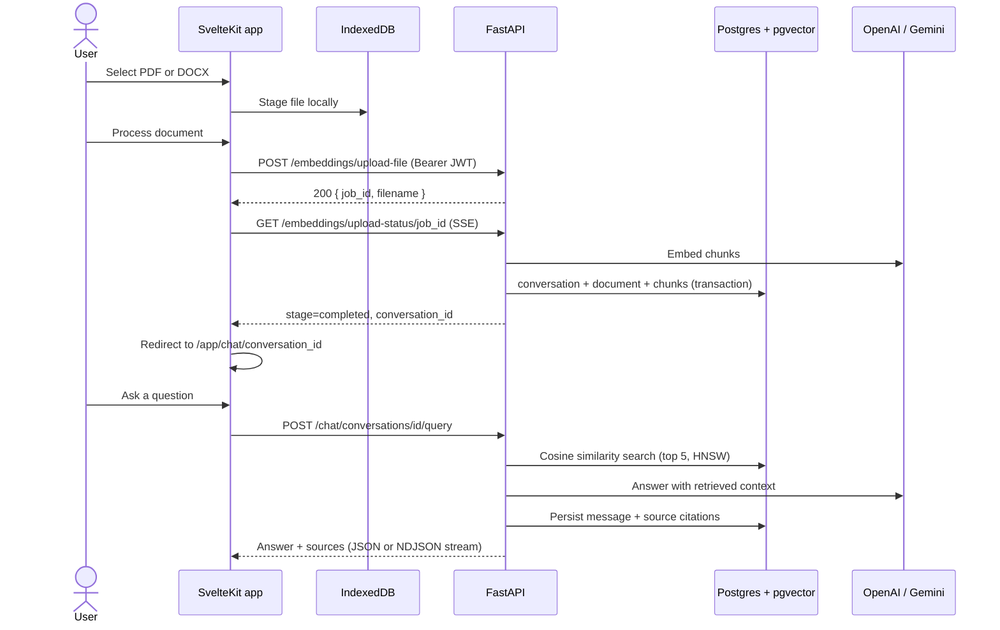
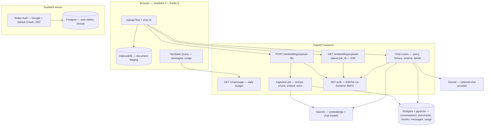

# Pyrags


Document-grounded question answering: upload a PDF or DOCX, watch it get extracted, chunked, embedded, and indexed in real time, then have a persistent conversation with it — every answer cited back to the exact passage and page it came from.

## Overview

Pyrags is a document intelligence application for studying academic and technical material — course notes, research papers, reports, and documentation. Upload a document and it becomes a conversation you can return to: questions are answered from the document's own text, with source passages attached so every claim can be verified.

The system is a SvelteKit frontend backed by a FastAPI service. Documents are processed as observable background jobs whose progress streams to the browser over SSE; chunks are embedded with OpenAI and stored in PostgreSQL with pgvector; retrieval is scoped to the conversation, so each conversation only ever answers from its own document.

## Features

**Document ingestion**

- PDF and DOCX upload, staged in the browser (IndexedDB) until explicitly confirmed
- Background processing job with per-stage progress streamed over Server-Sent Events (`upload → extracting → chunking → embedding → storing → completed`)
- Per-page PDF extraction with preserved page numbers (pypdf); paragraph-level DOCX extraction (python-docx)
- Recursive chunking (1000 chars / 200 overlap) with citation metadata captured at chunk time
- OpenAI `text-embedding-3-large` (1024 dimensions), stored in pgvector with an HNSW cosine index

**Conversations**

- Persistent conversations, messages, and citations in PostgreSQL — history survives restarts
- Conversation list with rename and delete
- Follow-up questions answered with full conversation history as context
- Optional token-by-token streaming (NDJSON), with a final completion event carrying the answer's sources
- Source citations persisted per assistant message — file name, file type, page number, chunk position

**Accounts and usage**

- Google and GitHub OAuth (Better Auth); the backend verifies EdDSA JWTs against the frontend JWKS endpoint
- Every API route is authenticated; conversations, documents, and upload jobs are scoped per user
- Daily query budget per user with an atomic reserve/refund design, `429` + `Retry-After` on exhaustion, and a usage endpoint the UI polls

**Platform**

- Fully containerized backend (Dockerfile + Compose with the `pgvector/pgvector:pg17` image)
- Alembic migrations, including the pgvector extension and HNSW index
- Optional mock API (`/mock/*`, disabled by default) that mirrors the real routes for frontend development — documented in `server/README.md`

## How It Works

1. **Select** — the user drops a PDF/DOCX into the app. The file is validated and staged in IndexedDB; nothing is uploaded yet.
2. **Confirm** — _Process documents_ uploads the file to `POST /embeddings/upload-file`. The backend validates it, allocates a `job_id` and a progress queue, starts a background task, and returns immediately.
3. **Track** — the frontend follows `GET /embeddings/upload-status/{job_id}` (SSE consumed over `fetch`, so the Bearer token can be attached) and renders live progress.
4. **Process** — the job extracts text, builds metadata-aware chunks, embeds them, and writes the conversation, document, and chunks transactionally. The final SSE event carries the new `conversation_id`.
5. **Chat** — the frontend redirects to `/app/chat/{conversation_id}`. Each question is embedded, matched against the conversation's chunks by cosine distance (top 5), and answered by the model with the retrieved passages as context — then the answer and its sources are persisted.



## Architecture



## Technology Stack

**Frontend** — SvelteKit 2, Svelte 5 (runes), TypeScript 6, Tailwind CSS 4, shadcn-svelte, TanStack Query, Better Auth, Drizzle ORM, Axios, marked + DOMPurify, IndexedDB, Cloudflare Workers adapter

**Backend** — FastAPI, Pydantic 2, SQLModel + async SQLAlchemy, Alembic, LangChain (model integrations + text splitters), pypdf, python-docx, PyJWT + httpx (JWKS)

**AI / Retrieval** — OpenAI `text-embedding-3-large` (1024d), OpenAI or Gemini chat models, pgvector cosine search with HNSW indexing, conversation-scoped retrieval

**Data** — PostgreSQL 17 + pgvector (application data), PostgreSQL 17 (auth, via Drizzle), IndexedDB (browser staging)

**Tooling** — uv, Bun, Docker Compose, Wrangler, drizzle-kit, ESLint + Prettier, svelte-check

## Project Structure

```text
Pyrags/
├── server/                          # FastAPI backend (Python 3.13, uv)
│   ├── main.py                      # App entry: config-driven CORS/debug, router
│   ├── Dockerfile                   # uv-based image; migrations run on start
│   ├── docker-compose.yaml          # pgvector Postgres, API, Adminer
│   ├── alembic/                     # Migrations (pgvector, tables, enums, JSONB)
│   └── app/
│       ├── core/                    # Settings (pydantic-settings), async DB session
│       ├── auth/                    # EdDSA JWT verification against frontend JWKS
│       ├── embeddings/              # Upload + SSE status routes, ingestion pipeline
│       ├── chat/                    # RAG service, routes, model factory, rate limiting
│       ├── model/                   # SQLModel tables: conversations, documents,
│       │                            #   document_chunks (vector), messages, usage
│       ├── repository/              # Data access (conversation-scoped vector search)
│       ├── mock/                    # Optional mock API for frontend development
│       └── health/                  # GET / liveness
└── web/                             # SvelteKit frontend (Svelte 5, TypeScript)
    ├── src/
    │   ├── routes/
    │   │   ├── +page.svelte         # Landing page with interactive product preview
    │   │   ├── sign-in/             # Google / GitHub OAuth
    │   │   └── app/                 # Protected workspace
    │   │       ├── +page.svelte     # Upload + processing flow
    │   │       └── chat/            # Conversation view
    │   └── lib/
    │       ├── api.ts               # Axios instance + Bearer interceptor
    │       ├── chat-stream.ts       # NDJSON/SSE stream reader
    │       ├── hooks/               # use-file-upload, use-upload-progress,
    │       │                        #   use-chat, use-query-usage
    │       ├── indexed-db/          # Document staging store
    │       ├── components/          # App shell, chat, sources, shadcn-svelte UI
    │       └── server/              # Better Auth config, Drizzle schema
    ├── drizzle/                     # Auth schema migration
    └── compose.yaml                 # Postgres 17 (auth database)
```

## Getting Started

Prerequisites: **uv**, **Bun**, **Docker**, an **OpenAI API key**.

**1. Backend** (http://127.0.0.1:8000)

```bash
cd server
docker compose up -d api-db     # Postgres 17 + pgvector on localhost:5433
cp .env.example .env            # set OPENAI_API_KEY, API_DB_PASSWORD, DATABASE_URL
uv sync
uv run alembic upgrade head
uv run uvicorn main:app --reload
```

`DATABASE_URL` for local development:

```text
postgresql+asyncpg://cipher:<API_DB_PASSWORD>@localhost:5433/pyrags
```

**2. Frontend** (http://localhost:5173)

```bash
cd web
bun install
cp .env.example .env            # auth secret, OAuth keys, DATABASE_URL, PUBLIC_BASE_URL
bun run db:start                # Postgres 17 for auth on localhost:5432
bun run db:push                 # Apply the Drizzle auth schema
bun run dev
```

Sign in with Google or GitHub, drop in a document, and process it — the app redirects into the new conversation when indexing completes.

## Environment Variables

**`server/.env`** (see `server/.env.example`):

| Variable               | Purpose                                                         |
| ---------------------- | --------------------------------------------------------------- |
| `OPENAI_API_KEY`       | Embeddings + default chat provider (required)                   |
| `GEMINI_API_KEY`       | Optional Gemini chat provider                                   |
| `DATABASE_URL`         | Async Postgres connection (pgvector-enabled)                    |
| `FRONTEND_URL`         | JWT issuer/audience; JWKS from `{FRONTEND_URL}/api/auth/jwks`   |
| `DEBUG`                | FastAPI debug mode — keep `false` outside development           |
| `ENABLE_MOCK_API`      | Mount unauthenticated `/mock/*` routes — local development only |
| `MOCK_*_DELAY_SECONDS` | Simulated latencies for the mock API                            |
| `API_DB_PASSWORD`      | Postgres password used by `docker-compose.yaml`                 |

**`web/.env`** (see `web/.env.example`):

| Variable                                    | Purpose                                                          |
| ------------------------------------------- | ---------------------------------------------------------------- |
| `DATABASE_URL`                              | Postgres connection for Better Auth (matches `web/compose.yaml`) |
| `APP_DB_PASSWORD`                           | Postgres password used by `web/compose.yaml`                     |
| `ORIGIN`                                    | Public base URL of the frontend                                  |
| `BETTER_AUTH_SECRET`                        | Auth signing secret (32+ chars, high entropy)                    |
| `GITHUB_CLIENT_ID` / `GITHUB_CLIENT_SECRET` | GitHub OAuth app credentials                                     |
| `GOOGLE_CLIENT_ID` / `GOOGLE_CLIENT_SECRET` | Google OAuth credentials                                         |
| `PUBLIC_BASE_URL`                           | FastAPI base URL (default `http://localhost:8000`)               |

## API Overview

All routes except `GET /` require a Bearer JWT. Mock mirrors exist under `/mock/*` when `ENABLE_MOCK_API=true`.

| Route                                    | Purpose                                                                |
| ---------------------------------------- | ---------------------------------------------------------------------- |
| `GET /`                                  | Liveness check                                                         |
| `POST /embeddings/upload-file`           | Start an ingestion job — `{ job_id, filename }`                        |
| `GET /embeddings/upload-status/{job_id}` | SSE stream of `JobProgress` events (owner-checked)                     |
| `POST /chat/conversations/{id}/query`    | Ask a question — JSON, or NDJSON token stream with `is_stream`         |
| `GET /chat/conversations?limit=`         | List the user's conversations, most recent first                       |
| `GET /chat/conversations/{id}`           | Conversation header with document count                                |
| `PATCH /chat/conversations/{id}`         | Rename a conversation                                                  |
| `DELETE /chat/conversations/{id}`        | Delete a conversation and its data                                     |
| `GET /chat/conversations/{id}/messages`  | Message history with persisted citations                               |
| `GET /chat/usage`                        | Daily query budget: `{ limit, used, remaining, unlimited, resets_at }` |

Interactive documentation is available at `/docs` when the server is running.

## Development Status

Pyrags is **v1 in active development**. The core loop is complete end to end: authenticated upload → real-time ingestion → persistent, citation-backed conversations with per-user isolation and rate limiting. APIs and schemas may still change between versions.

### Roadmap

- **Multiple documents per conversation** — the schema supports it; uploads currently create a new conversation each time
- **AI-generated conversation titles** (today the title is the filename)
- **Durable job queue** for ingestion (jobs are in-process; fine for a single instance, not for multi-replica deployments)
- **Automated tests and CI**
- **Hosted deployment guide** — the API Dockerfile and Cloudflare Worker config already exist

## Known Limitations

- Upload job state (queues, SSE streams) is in-memory: a restart drops in-flight jobs, and horizontal scaling requires an external queue.
- One document per conversation; replacing it means starting a new conversation.
- DOCX citations have no page numbers (paragraph extraction does not preserve rendered page layout).
- The daily query budget is currently fixed in code (6 per day, resetting at midnight Africa/Lagos), with a single unlimited-account override.
- The model picker in the UI exposes OpenAI models; Gemini is available through the API.
- Keep `ENABLE_MOCK_API=false` outside local development — mock routes are intentionally unauthenticated.

## License

No license has been chosen yet. Until one is added, all rights remain with the author.
