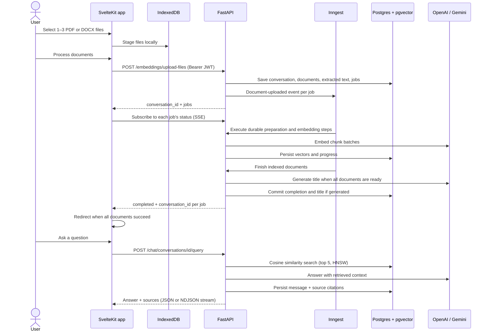
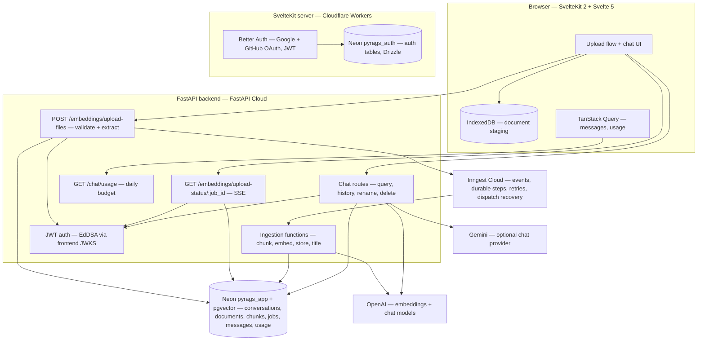

# Pyrags


Document-grounded question answering: upload up to three PDF or DOCX documents, follow their processing progress, and explore them in one persistent conversation with source passages and page references where available.

**V1 is deployed in production.** [Try Pyrags](https://pyrags.cipher-dev.cv).

## Overview

Pyrags is a document intelligence application for studying academic and technical material — course notes, research papers, reports, and documentation. Upload a document and it becomes a conversation you can return to: questions are answered from the document's own text, with source passages attached so every claim can be verified.

The system is a SvelteKit frontend backed by a FastAPI service. Inngest orchestrates durable ingestion workflows while PostgreSQL persists document data and job progress. Progress streams to the browser over SSE; chunks are embedded with OpenAI and stored with pgvector; retrieval is scoped to the documents belonging to the conversation. No Redis is required.

## Features

**Document ingestion**

- One to three PDF/DOCX files per conversation, each smaller than 10 MiB, staged in IndexedDB until explicitly confirmed
- Durable Inngest steps for chunk preparation and embedding/storage batches, with per-document progress streamed over Server-Sent Events
- PostgreSQL-backed jobs and scheduled recovery of saved jobs whose events have not been dispatched
- Per-page PDF extraction with preserved page numbers (pypdf); paragraph-level DOCX extraction (python-docx)
- Recursive chunking (1000 chars / 200 overlap) with citation metadata captured at chunk time
- OpenAI `text-embedding-3-large` (1024 dimensions), stored in pgvector with an HNSW cosine index

**Conversations**

- Persistent conversations, messages, and citations in PostgreSQL — history survives restarts
- Conversation list with rename and delete
- LLM-generated subject titles after all documents finish processing, with filename fallback and protection for manually renamed titles
- Follow-up questions answered with full conversation history as context
- Token-by-token streaming enabled by default in the UI (NDJSON), with a final completion event carrying the answer's sources
- Source citations persisted per assistant message — file name, file type, page number, chunk position

**Accounts and usage**

- Google and GitHub OAuth (Better Auth); the backend verifies EdDSA JWTs against the frontend JWKS endpoint
- Application data routes require authentication; conversations, documents, and upload jobs are scoped per user
- Six daily queries for standard accounts, visible in the UI, with an atomic reserve/refund design, `429` + `Retry-After` on exhaustion, and an unlimited-owner override

**Platform**

- Production frontend on Cloudflare Workers, API on FastAPI Cloud, separate Neon databases for auth/application data, and Inngest Cloud for workflow orchestration
- Responsive upload/chat interfaces, a mobile sidebar toggle, light/dark themes, and a document/source sidebar
- Request-scoped Better Auth database connections for Cloudflare Workers, with redacted authentication/chat error diagnostics
- Fully containerized backend (Dockerfile + Compose with the `pgvector/pgvector:pg17` image)
- Alembic migrations, including the pgvector extension and HNSW index
- Optional mock API (`/mock/*`, disabled by default) that mirrors the real routes for frontend development — documented in `server/README.md`

## How It Works

1. **Select** — the user selects up to three PDF/DOCX files, each smaller than 10 MiB. Files are validated and staged in IndexedDB; nothing is uploaded yet.
2. **Confirm** — _Process documents_ sends the files to `POST /embeddings/upload-files`. The backend validates and extracts the entire batch, commits one conversation with its documents and recoverable jobs to PostgreSQL, then sends an Inngest event for each job.
3. **Track** — the frontend follows `GET /embeddings/upload-status/{job_id}` (SSE consumed over `fetch`, so the Bearer token can be attached) and renders live progress.
4. **Process** — FastAPI serves Inngest functions that prepare metadata-aware chunks from persisted extracted text, embed them in batches, and store vectors transactionally. Failed work can retry without repeating successful durable steps. Fully indexed documents become READY. The last document to finish attempts title generation before committing its completion. The final SSE events carry the `conversation_id`.
5. **Chat** — once every document is READY, the frontend redirects to `/app/chat/{conversation_id}`. Each question is embedded, matched across the conversation's documents by cosine distance (top 5), and answered with retrieved passages as context — then the answer and sources are persisted. A failed document blocks chat until the user reprocesses the full selection into a new conversation.



## Architecture



## Technology Stack

**Frontend** — SvelteKit 2, Svelte 5 (runes), TypeScript 6, Tailwind CSS 4, shadcn-svelte, TanStack Query, Better Auth, Drizzle ORM, Axios, marked + DOMPurify, IndexedDB, Cloudflare Workers adapter

**Backend** — FastAPI, Pydantic 2, SQLModel + async SQLAlchemy, Alembic, Inngest Python SDK, LangChain (model integrations + text splitters), pypdf, python-docx, PyJWT + httpx (JWKS)

**AI / Retrieval** — OpenAI `text-embedding-3-large` (1024d), OpenAI or Gemini chat models, pgvector cosine search with HNSW indexing, conversation-scoped retrieval

**Data** — PostgreSQL 17 + pgvector (application data), PostgreSQL 17 (auth, via Drizzle), IndexedDB (browser staging)

**Production hosting** — Cloudflare Workers, FastAPI Cloud, Neon PostgreSQL, Inngest Cloud

**Tooling** — uv, Bun, Docker Compose, Wrangler, drizzle-kit, ESLint + Prettier, svelte-check

## Project Structure

```text
Pyrags/
├── server/                          # FastAPI backend (Python 3.13, uv)
│   ├── main.py                      # App entry, CORS, routers, Inngest serving
│   ├── Makefile                     # Local services, Inngest, dev/prod migrations
│   ├── Dockerfile                   # uv-based image; migrations run on start
│   ├── docker-compose.yaml          # pgvector Postgres, API, Adminer
│   ├── alembic/                     # Migrations (pgvector, tables, enums, JSONB)
│   └── app/
│       ├── core/                    # Settings (pydantic-settings), async DB session
│       ├── auth/                    # EdDSA JWT verification against frontend JWKS
│       ├── embeddings/              # Upload + SSE status routes, ingestion pipeline
│       ├── workflows/               # Inngest processing and pending-event dispatcher
│       ├── chat/                    # RAG service, routes, model factory, rate limiting
│       ├── model/                   # SQLModel tables: conversations, documents,
│       │                            #   document_chunks (vector), ingestion_jobs, messages, usage
│       ├── repository/              # Data access (conversation-scoped vector search)
│       ├── mock/                    # Optional mock API for frontend development
│       └── health/                  # GET / liveness
└── web/                             # SvelteKit frontend (Svelte 5, TypeScript)
    ├── src/
    │   ├── routes/
    │   │   ├── +page.svelte         # Landing page with interactive product preview
    │   │   ├── sign-in/             # Google / GitHub OAuth
    │   │   ├── tutorials/           # Project-specific Inngest learning guide
    │   │   └── app/                 # Protected workspace
    │   │       ├── +page.svelte     # Upload + processing flow
    │   │       └── chat/            # Conversation view
    │   └── lib/
    │       ├── api.ts               # Axios instance + Bearer interceptor
    │       ├── chat-stream.ts       # NDJSON/SSE stream reader
    │       ├── hooks/               # use-file-upload, use-upload-progress,
    │       │                        #   use-chat, use-query-usage
    │       ├── indexed-db/          # Document staging store
    │       ├── components/          # App shell, chat, sources, shadcn-svelte UI
    │       └── server/              # Auth factory, auth-cli.ts, redacted logger,
    │                                #   DB factory, db/auth.schema.ts tables
    ├── drizzle/                     # Auth schema migration
    └── compose.yaml                 # Postgres 17 (auth database)
```

## Getting Started

Prerequisites: **uv**, **Bun**, **Docker**, **Node.js/npm** for the Inngest Dev Server command, an **OpenAI API key**, and development OAuth credentials.

**1. Backend** (http://127.0.0.1:8000)

```bash
cd server
docker compose up -d api-db     # Postgres 17 + pgvector on localhost:5433
cp .env.example .env            # set OPENAI_API_KEY, API_DB_PASSWORD, LOCAL_DATABASE_URL
make sync
make migrate
make dev                       # FastAPI in local Inngest mode
# In another server/ terminal: make inngest
```

Set `APP_ENV=development` and `LOCAL_DATABASE_URL` for local development:

```text
postgresql+asyncpg://cipher:<API_DB_PASSWORD>@localhost:5433/pyrags
```

**2. Frontend** (http://localhost:5173)

```bash
cd web
bun install
cp .env.example .env            # auth secret, OAuth keys, LOCAL_DATABASE_URL, PUBLIC_BASE_URL
bun run db:start                # Postgres 17 for auth on localhost:5432
APP_ENV=development bun run db:migrate  # Apply the committed Drizzle migrations
bun run dev
```

The frontend `.env.example` still names `DATABASE_URL`: replace it with `LOCAL_DATABASE_URL` and add `APP_ENV=development` to match the current database configuration. The local auth URL normally uses `postgres://cipher:<APP_DB_PASSWORD>@localhost:5432/pyrags`. Start the database in one terminal and run migrations/dev in another.

The local Inngest dashboard is at `http://127.0.0.1:8288`. Sign in with Google or GitHub, select documents, and process them — the app redirects into the new conversation when every document is ready.

## Environment Variables

Only the database URL selected by `APP_ENV` is required. The backend computes `DATABASE_URL` internally; credentials are configured with `LOCAL_DATABASE_URL` or `NEON_DATABASE_URL`. Keep provider, database, and auth secrets out of source control and browser-visible `PUBLIC_*` variables.

**`server/.env`** (see `server/.env.example`):

| Variable               | Purpose                                                         |
| ---------------------- | --------------------------------------------------------------- |
| `OPENAI_API_KEY`       | Embeddings + default chat provider (required)                   |
| `GEMINI_API_KEY`       | Optional Gemini chat provider                                   |
| `APP_ENV`              | `development` locally; `production` selects Neon and requires Inngest keys |
| `LOCAL_DATABASE_URL`   | Local application PostgreSQL connection (pgvector-enabled) |
| `NEON_DATABASE_URL`    | Production `pyrags_app` connection; normalized for asyncpg and SSL |
| `INNGEST_EVENT_KEY`    | Production event publishing credential |
| `INNGEST_SIGNING_KEY`  | Production Inngest endpoint authentication |
| `INNGEST_DEV`          | Set to `1` locally by `make dev`; unset or `0` in production |
| `MAX_UPLOAD_SIZE_MB`   | Per-document ceiling, default 10, configurable down to 1 |
| `FRONTEND_URL`         | JWT issuer/audience; JWKS from `{FRONTEND_URL}/api/auth/jwks`   |
| `DEBUG`                | FastAPI debug mode — keep `false` outside development           |
| `ENABLE_MOCK_API`      | Mount unauthenticated `/mock/*` routes — local development only |
| `MOCK_*_DELAY_SECONDS` | Simulated latencies for the mock API                            |
| `API_DB_PASSWORD`      | Postgres password used by `docker-compose.yaml`                 |

**`web/.env`** (see `web/.env.example`):

| Variable                                    | Purpose                                                          |
| ------------------------------------------- | ---------------------------------------------------------------- |
| `APP_ENV`                                   | Select local or production authentication database |
| `LOCAL_DATABASE_URL`                        | Local auth PostgreSQL connection (matches `web/compose.yaml`) |
| `NEON_DATABASE_URL`                         | Production `pyrags_auth` connection, not `pyrags_app` |
| `APP_DB_PASSWORD`                           | Postgres password used by `web/compose.yaml`                     |
| `ORIGIN`                                    | Public base URL of the frontend                                  |
| `PUBLIC_ORIGIN`                             | Frontend base URL fallback if `ORIGIN` is absent |
| `BETTER_AUTH_SECRET`                        | Auth signing secret (32+ chars, high entropy)                    |
| `GITHUB_CLIENT_ID` / `GITHUB_CLIENT_SECRET` | GitHub OAuth app credentials                                     |
| `GOOGLE_CLIENT_ID` / `GOOGLE_CLIENT_SECRET` | Google OAuth credentials                                         |
| `PUBLIC_BASE_URL`                           | FastAPI base URL (default `http://localhost:8000`)               |

## Production Setup

| Service | Production address / resource |
| --- | --- |
| SvelteKit frontend | `https://pyrags.cipher-dev.cv` |
| FastAPI backend | `https://api.pyrags.cipher-dev.cv` |
| Inngest sync endpoint | `https://api.pyrags.cipher-dev.cv/api/inngest` |
| Neon authentication database | `pyrags_auth`, migrated with Drizzle |
| Neon application database | `pyrags_app`, migrated with Alembic, including pgvector |

### Database migrations

Configure the intended production URLs before migrating. Use direct database connections for migrations, and keep backups before schema changes:

```bash
cd web
APP_ENV=production bun run db:migrate
cd ../server
make migrate-prod
```

Alembic imports application settings, so the production Inngest event/signing keys must also be configured when running `make migrate-prod`.

### Frontend — Cloudflare Workers

- Root directory: `web`.
- Build command: `bun install --frozen-lockfile && bun run build`.
- Deploy command: `bunx wrangler deploy`.
- Pin `BUN_VERSION` to a version compatible with the committed lockfile.
- Configure runtime variables/secrets independently from build variables. Set `APP_ENV=production`, `ORIGIN=https://pyrags.cipher-dev.cv`, `PUBLIC_BASE_URL=https://api.pyrags.cipher-dev.cv`, the `pyrags_auth` Neon URL, and the auth/OAuth secrets.

Better Auth and its Postgres client are created per request and closed afterward; Workers cannot share request-owned sockets. The database schema lives in `db/auth.schema.ts`; `auth-cli.ts` is only the schema-generation command's configuration. The request-scoped factory also avoids opening the auth database during build analysis.

Authenticated API requests use `cache: 'no-store'` to avoid Workers' unsupported `default` cache mode. Auth/chat diagnostics log redacted nested errors rather than tokens or response content.

### Backend — FastAPI Cloud

Deploy the application from `server` with `APP_ENV=production`, the `pyrags_app` Neon URL, `FRONTEND_URL=https://pyrags.cipher-dev.cv`, `OPENAI_API_KEY`, and both Inngest keys. Keep `DEBUG=false`, `ENABLE_MOCK_API=false`, and `INNGEST_DEV` unset or `0`.

### Inngest Cloud

Select the production environment and sync the backend's `/api/inngest` endpoint. Confirm app `pyrags-app` registers both `process-document` and `dispatch-pending-documents`. Resync after changing function definitions.

Inngest orchestrates and retries the workflow; the deployed FastAPI host executes the Python functions. The scheduled dispatcher checks for saved jobs still awaiting event dispatch once per minute.

### OAuth and release verification

Register the following production callbacks with their respective providers:

```text
https://pyrags.cipher-dev.cv/api/auth/callback/github
https://pyrags.cipher-dev.cv/api/auth/callback/google
```

Use separate development and production secrets/OAuth configuration. After deployment changes, test sign-in, multi-document processing, title generation, chat, citations, history, and account isolation end to end.

## API Overview

Application data routes require a Bearer JWT. Health and API documentation do not require that JWT. Inngest execution uses its own production signing-key authentication, not user Bearer tokens. Mock mirrors exist under `/mock/*` when `ENABLE_MOCK_API=true` and are intentionally unauthenticated.

| Route                                    | Purpose                                                                |
| ---------------------------------------- | ---------------------------------------------------------------------- |
| `GET /`                                  | Liveness check                                                         |
| `POST /embeddings/upload-files`          | Start a 1–3-document batch — `conversation_id` and per-document jobs |
| `POST /embeddings/upload-file`           | Start an ingestion job — `{ job_id, filename }`                        |
| `GET /embeddings/upload-status/{job_id}` | SSE stream of `JobProgress` events (owner-checked)                     |
| `POST /chat/conversations/{id}/query`    | Ask a question — JSON, or NDJSON token stream with `is_stream`         |
| `GET /chat/conversations?limit=`         | List the user's conversations, most recent first                       |
| `GET /chat/conversations/{id}`           | Conversation header with document count                                |
| `PATCH /chat/conversations/{id}`         | Rename a conversation                                                  |
| `DELETE /chat/conversations/{id}`        | Delete a conversation and its data                                     |
| `GET /chat/conversations/{id}/messages`  | Message history with persisted citations                               |
| `GET /chat/usage`                        | Daily query budget: `{ limit, used, remaining, unlimited, resets_at }` |
| `/api/inngest`                          | SDK-managed function discovery, synchronization, and execution |

Interactive documentation is available at `/docs` when the server is running.

## Release Status

Pyrags **V1 is live in production**. The shipped loop includes authenticated multi-document uploads, durable processing, AI-generated titles, persistent citation-backed chat, per-user isolation, and visible daily query limits.

### Roadmap

- **Add documents to an existing conversation** — initial uploads already support up to three documents together
- **Expanded automated testing and CI coverage**
- **OCR support** for scanned/image-only documents
- **Configurable usage policies** instead of fixed limits

## Known Limitations

- Original file extraction happens in the upload request; only extracted text is retained for durable processing. Interrupted embedding calls can be billed again before their vectors commit.
- Original document binaries are not retained for later downloads. Image-only documents without extractable text are rejected; OCR is not implemented.
- Up to three documents per new conversation; every document must process successfully before chat is available. Reprocessing a batch creates a new conversation.
- DOCX citations have no page numbers (paragraph extraction does not preserve rendered page layout).
- The daily query budget is currently fixed in code (6 per day, resetting at midnight Africa/Lagos), with a single unlimited-account override.
- The model picker in the UI exposes OpenAI models; Gemini is available through the API.
- Keep `ENABLE_MOCK_API=false` outside local development — mock routes are intentionally unauthenticated.
- Generated answers can be incomplete or incorrect. Source passages help users verify responses; they do not guarantee factual accuracy.

## License

No license has been chosen yet. Until one is added, all rights remain with the author.
