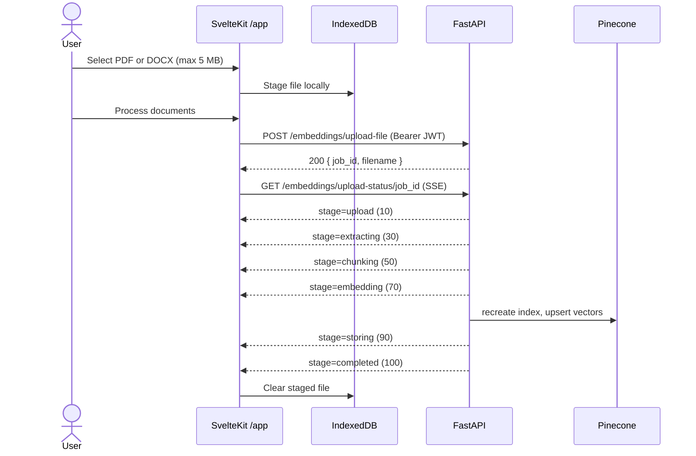
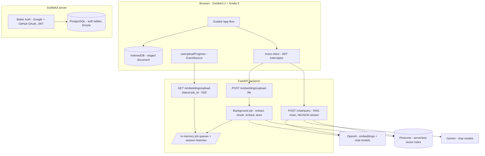

# Pyrags


Document-grounded question answering with real-time ingestion — upload a PDF or DOCX, watch it get extracted, chunked, embedded, and indexed over SSE, then query it through a citation-backed retrieval API.

> **Status:** Pyrags is in active early development. The document ingestion pipeline and the RAG query API are functional end to end; the chat interface, persistent conversations, and per-user document storage are on the roadmap. Expect breaking changes.

## Overview

Pyrags is a document intelligence system for studying academic and technical material — course slides, lecture notes, papers, and documentation. Instead of a one-shot "upload and hope" flow, it treats document processing as a first-class, observable job: the file is staged locally in the browser, processing starts only when the user confirms, and every backend stage streams back to the UI in real time.

The system is a SvelteKit 5 application backed by a FastAPI service. Documents are converted into metadata-rich chunks (file, type, page number, chunk position), embedded with OpenAI, and indexed in Pinecone. A LangChain retrieval chain answers questions strictly from the indexed document and returns the source passages used, so every answer can be traced back to the material.

Where it is going: persistent, per-user conversation and document storage (Postgres), conversation-scoped retrieval, and a full conversational UI.

## Current Capabilities

**Authentication & users**

- OAuth sign-in with Google or GitHub (Better Auth), sessions stored in Postgres via Drizzle
- JWT issuance with a custom `{id, email}` payload; protected `/app` workspace with server-side route guard
- Authenticated API client: an Axios interceptor attaches the Better Auth JWT as a Bearer token to every backend request

**Document ingestion (functional end to end)**

- PDF and DOCX upload with client-side validation (type, ≤ 5 MB, single document)
- Browser-side staging in IndexedDB — a selected document survives page reloads and is only sent to the server when the user confirms processing
- Asynchronous, job-based processing on the backend with per-stage progress streamed over SSE
- Text extraction with page fidelity (per-page PDF extraction; paragraph-level DOCX extraction)
- Recursive chunking with citation metadata (`file_name`, `file_type`, `page_number`, `chunk_index`)
- OpenAI embeddings (`text-embedding-3-large`, 1024 dimensions) stored in a Pinecone serverless index

**Retrieval & chat API (backend functional; frontend UI in progress)**

- `POST /chat/query` — document-grounded answers over a history-aware retrieval chain (k=5)
- Source citations returned with every non-streaming answer
- Session-scoped follow-up questions via `session_id` (in-memory history)
- Optional token streaming as NDJSON with an `X-Session-ID` header
- Pluggable chat models: OpenAI (default `gpt-5-nano`) or Gemini (default `gemini-2.5-flash`), with validated model options

## Document Processing Flow

The implemented lifecycle deliberately separates **selecting** a document from **processing** it:

1. **Select** — the user drops a PDF/DOCX into `/app`. The file is validated and written to IndexedDB (`pyrags.documents`), so it survives reloads. Nothing is uploaded yet.
2. **Confirm** — clicking _Process documents_ uploads the file to `POST /embeddings/upload-file`. The backend validates the extension, allocates a `job_id` and an in-memory progress queue, starts a background task, and returns `{job_id, filename}` immediately.
3. **Track** — the frontend opens an `EventSource` on `GET /embeddings/upload-status/{job_id}` and renders live progress.
4. **Process** — the background job extracts text (per page for PDF), splits it into metadata-aware chunks, generates embeddings, and recreates + populates the Pinecone index. Each stage publishes a `JobProgress` event.
5. **Ready** — on `completed`, the backend invalidates its cached RAG chains (so the next query reads the new index) and the frontend clears the staged file from IndexedDB and marks the document ready.



## Real-Time Processing

Long-running ingestion runs as an **in-process job** rather than a blocking request:

- `POST /embeddings/upload-file` returns a `job_id` immediately; work continues in an `asyncio` background task.
- Each job owns an `asyncio.Queue`. The pipeline publishes typed `JobProgress` events (`stage`, `message`, `progress`) as it moves through extraction, chunking, embedding, and storage.
- `GET /embeddings/upload-status/{job_id}` drains that queue as **Server-Sent Events** and terminates on `completed` or `error`.
- On the frontend, `useUploadProgress` wraps the `EventSource` in reactive Svelte 5 state with completion/error callbacks and automatic teardown.

CPU- and network-bound stages (parsing, embedding, upserting) run in worker threads via `asyncio.to_thread`, keeping the event loop responsive while a job is in flight.

## Frontend Architecture

`web/` — SvelteKit 2, Svelte 5 (runes mode enforced project-wide), TypeScript 6, Tailwind CSS 4.

- **Component system:** shadcn-svelte (bits-ui), lucide icons, `svelte-sonner` toasts, `mode-watcher` theming
- **Auth:** Better Auth client/server with Google + GitHub providers and the JWT plugin; sessions resolved in `hooks.server.ts`; `/app` guarded by a server load function
- **API layer:** a single Axios instance (`src/lib/api.ts`) with a request interceptor that fetches the Better Auth JWT and attaches it as a Bearer token; route constants in `src/lib/api_routes.ts`
- **Reusable stateful hooks** (Svelte 5 `$state`/`$effect` runes):
  - `useFileUpload` — selection, validation feedback, IndexedDB staging, upload
  - `useUploadProgress` — SSE subscription, progress state, lifecycle callbacks
- **Browser persistence:** a small raw-IndexedDB module (`src/lib/indexed-db/documents.ts`) storing staged `File` objects with typed metadata
- **Data:** Drizzle ORM over Postgres (auth tables only, for now)
- **Deployment target:** Cloudflare Workers (`@sveltejs/adapter-cloudflare` + Wrangler)

## Backend Architecture

`server/` — FastAPI (Python 3.13, managed with uv), organized as feature modules behind a root router:

- **`embeddings`** — upload endpoint, SSE status endpoint, and the processing pipeline: extract (`pypdf`, `python-docx`) → chunk (`RecursiveCharacterTextSplitter`) → embed (`langchain-openai`) → store (`langchain-pinecone` / Pinecone serverless)
- **`chat`** — LangChain history-aware retrieval chain over Pinecone; `ModelFactory` for OpenAI/Gemini chat models; per-configuration chain caching with invalidation on each new indexed document; in-memory session histories; NDJSON token streaming
- **`auth`** — EdDSA JWT verification against the frontend JWKS endpoint with a kid-keyed key cache (implemented; route enforcement is a roadmap item)
- **`health`** — liveness endpoint

The HTTP layer, service layer, and LangChain boundary each have their own Pydantic contracts (`ChatRequest`/`ChatServiceRequest`/`RagChainRequest`), so third-party chain shapes never leak into the API.



## Technology Stack

**Frontend** — SvelteKit 2, Svelte 5 (runes), TypeScript 6, Tailwind CSS 4, shadcn-svelte / bits-ui, Axios, Better Auth, Drizzle ORM, `svelte-file-dropzone`, IndexedDB

**Backend** — FastAPI 0.141, Pydantic 2 / pydantic-settings, LangChain 1.x (`langchain-openai`, `langchain-google-genai`, `langchain-pinecone`, `langchain-text-splitters`), pypdf, python-docx, PyJWT + httpx (JWKS)

**AI / Retrieval** — OpenAI `text-embedding-3-large` (1024 dims), OpenAI or Gemini chat models, Pinecone serverless vector index, similarity retrieval (k=5) with a history-aware retriever

**Database / Persistence** — PostgreSQL 17 (auth, via Drizzle; Docker Compose), IndexedDB (browser document staging)

**Tooling** — uv (Python), Bun, Vite 8, Wrangler / Cloudflare adapter, drizzle-kit, ESLint + Prettier, svelte-check

## Project Structure

```text
Pyrags/
├── server/                        # FastAPI backend (Python 3.13, uv)
│   ├── main.py                    # App entry: CORS, router registration
│   ├── config.py                  # pydantic-settings configuration
│   ├── docker-compose.yaml        # Postgres + API scaffold (DB not yet used)
│   └── app/
│       ├── router.py              # Route registry
│       ├── auth/                  # JWT (EdDSA/JWKS) verification utilities
│       ├── chat/                  # RAG chain, model factory, sessions, prompts
│       ├── embeddings/            # Upload + SSE endpoints, pipeline, Pinecone store
│       └── health/                # GET / liveness
└── web/                           # SvelteKit frontend (Svelte 5, TypeScript)
    ├── src/
    │   ├── hooks.server.ts        # Session resolution
    │   ├── lib/
    │   │   ├── api.ts             # Axios instance + Bearer interceptor
    │   │   ├── api_routes.ts      # Backend route constants
    │   │   ├── auth-client.ts     # Better Auth client (JWT plugin)
    │   │   ├── hooks/             # useFileUpload, useUploadProgress (SSE)
    │   │   ├── indexed-db/        # Document staging store
    │   │   ├── server/            # auth.ts, db/ (Drizzle auth schema)
    │   │   └── components/        # shadcn-svelte UI, sidebar, nav-user
    │   └── routes/
    │       ├── sign-in/           # OAuth sign-in
    │       └── app/               # Protected upload + processing flow
    ├── drizzle/                   # Auth schema migration
    ├── compose.yaml               # Postgres 17 (auth database)
    └── wrangler.jsonc             # Cloudflare Workers deployment
```

## Getting Started

Prerequisites: **uv**, **Bun**, **Docker**, plus OpenAI and Pinecone API keys.

**1. Backend** (http://127.0.0.1:8000)

```bash
cd server
uv sync
uv run uvicorn main:app --reload
```

Create `server/.env` first (see below) — there is no `.env.example` yet.

**2. Frontend** (http://localhost:5173)

```bash
cd web
bun install
cp .env.example .env    # fill in values; also add GOOGLE_* and PUBLIC_BASE_URL
bun run db:start        # Postgres 17 for auth, via Docker Compose
bun run db:push         # Apply the Drizzle auth schema
bun run dev
```

## Environment Variables

**`web/.env`** (see `web/.env.example` — note it currently omits the Google and API-base entries below):

| Variable                                    | Purpose                                                             |
| ------------------------------------------- | ------------------------------------------------------------------- |
| `DATABASE_URL`                              | Postgres connection for Better Auth (must match `web/compose.yaml`) |
| `ORIGIN`                                    | Base URL of the frontend (e.g. `http://localhost:5173`)             |
| `BETTER_AUTH_SECRET`                        | Auth signing secret (32+ chars, high entropy)                       |
| `GITHUB_CLIENT_ID` / `GITHUB_CLIENT_SECRET` | GitHub OAuth app credentials                                        |
| `GOOGLE_CLIENT_ID` / `GOOGLE_CLIENT_SECRET` | Google OAuth credentials                                            |
| `PUBLIC_BASE_URL`                           | FastAPI base URL (defaults to `http://localhost:8000`)              |
| `APP_DB_PASSWORD`                           | Postgres password used by `web/compose.yaml`                        |

**`server/.env`** (no example file yet; keys read by `server/config.py`):

| Variable              | Purpose                                                                  |
| --------------------- | ------------------------------------------------------------------------ |
| `OPENAI_API_KEY`      | Embeddings + default chat provider                                       |
| `GEMINI_API_KEY`      | Optional, for the Gemini chat provider                                   |
| `PINECONE_API_KEY`    | Vector store                                                             |
| `PINECONE_INDEX_NAME` | Index name (default `pyrags`)                                            |
| `FRONTEND_URL`        | JWT issuer/audience; JWKS is fetched from `{FRONTEND_URL}/api/auth/jwks` |
| `DATABASE_URL`        | Reserved — backend persistence is not implemented yet                    |

## Development Status

Pyrags is in **active early development**. What works today: authentication, the browser-staged upload flow, the real-time ingestion pipeline, vector indexing, and the RAG query API (including streaming and session follow-ups). What does not: the chat UI, any form of server-side persistence for documents or conversations, and backend route authorization. APIs and data models will change without notice.

## Roadmap / In Progress

- **Chat interface** — the `/chat/query` API, streaming protocol, and the frontend route constant exist; the UI does not
- **Persistent conversations** — `Conversation` / `Message` models; the in-memory session store is explicitly marked for replacement
- **Document model & multi-document library** — uploads currently replace the entire index; only one staged document is supported by design
- **Backend Postgres integration** — `DATABASE_URL` and a Compose service are provisioned but unused; pgvector-backed chunk storage is a candidate direction alongside relational models
- **Conversation-scoped retrieval** — create a conversation when processing completes, return its `conversation_id` in the final SSE event, and redirect into the conversation view
- **AI-generated conversation titles** and persistent chat history
- **Backend route authorization** — the JWT dependency (`get_user_current`) is implemented but not yet attached to routes
- API Dockerfile, tests, CI

## Engineering Notes

- **Selection is decoupled from processing.** Files are staged in IndexedDB and only hit the network after explicit confirmation, which makes the pre-upload state reload-safe and keeps large files off the wire until they are wanted.
- **Jobs, not requests.** Ingestion runs as a background task with a per-job queue, so the upload request returns immediately and progress is observable over SSE instead of a spinner on a hanging POST.
- **Citations are a data-model decision, not a UI afterthought.** Page numbers and chunk positions are captured at chunking time and flow through embeddings, Pinecone metadata, retrieval, and the API response as typed models.
- **Typed boundary around LangChain.** The chain speaks LCEL mappings; the application speaks Pydantic models, with explicit adapters between them.
- **Cache invalidation on re-index.** RAG chains are cached per model configuration and flushed when a new document finishes indexing, so answers always reflect the active document.

## Known Limitations

- **Single-document knowledge base.** Storing vectors deletes and recreates the Pinecone index, so a new upload replaces the previously indexed document. Vector data is global — not scoped per user.
- **Volatile state.** Job queues and chat sessions live in process memory: they are lost on restart and make multi-instance deployment unsafe. Job queues are also never reaped after completion.
- **Backend endpoints are currently unauthenticated** (the JWT dependency exists but is not wired in), CORS allows all origins with credentials, and the app runs in debug mode — development posture, not deployment posture.
- Streaming chat responses contain only answer tokens; source documents are returned by the non-streaming response only.
- DOCX sources have no page numbers (paragraph extraction does not preserve rendered layout).
- Uploads are limited to one PDF/DOCX up to 5 MB, validated client-side; the backend checks extension only and reads the whole file into memory.
- The frontend has no chat UI yet; the root route is a temporary health-check page.

## License

No license has been chosen yet. Until one is added, this code is not open source in the legal sense — all rights remain with the author.
